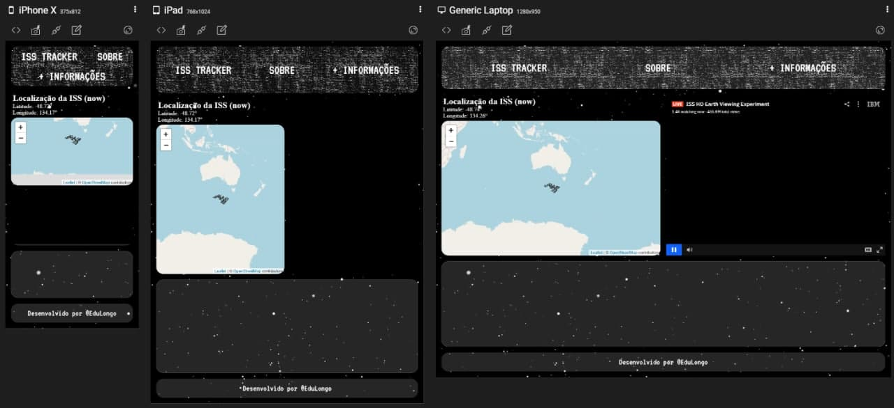

# iss_webmap

Webmap de um "tracking" do satélite ISS (API) + LiveCam do Satélite :)

Link preview: https://isswebmap.eduardolongo1.repl.co/
## Screenshots

## Funcionalidades

- Background com efeito super bacana;
- Preview em tempo real da localização (lat x long) do ISS-Satélite;
- Webmap pela library Leaflet-js;
- Responsividade;
- Criatividade;

## Autores

- [@EduLongo](https://github.com/edulongodevgeo)

## Stack utilizada

**Front-end:** HTML, CSS & Javascript (+ https://leafletjs.com/)

